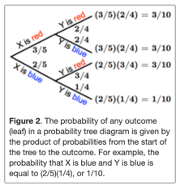

# Mendel's First Law

## Problem
Probability is the mathematical study of randomly occurring phenomena. We will model such a phenomenon with a random variable, which is simply a variable that can take a number of different distinct outcomes depending on the result of an underlying random process.

For example, say that we have a bag containing 3 red balls and 2 blue balls. If we let X represent the random variable corresponding to the color of a drawn ball, then the probability of each of the two outcomes is given by Pr(X=red)=35 and Pr(X=blue)=25.

Random variables can be combined to yield new random variables. Returning to the ball example, let Y model the color of a second ball drawn from the bag (without replacing the first ball). The probability of Y being red depends on whether the first ball was red or blue. To represent all outcomes of X and Y, we therefore use a probability tree diagram. This branching diagram represents all possible individual probabilities for X and Y, with outcomes at the endpoints ("leaves") of the tree. The probability of any outcome is given by the product of probabilities along the path from the beginning of the tree; see Figure 2 for an illustrative example.

An event is simply a collection of outcomes. Because outcomes are distinct, the probability of an event can be written as the sum of the probabilities of its constituent outcomes. For our colored ball example, let A be the event "Y is blue." Pr(A) is equal to the sum of the probabilities of two different outcomes: Pr(X=blue and Y=blue)+Pr(X=red and Y=blue), or 310+110=25 (see Figure 2 above).

+ Given: Three positive integers k, m, and n, representing a population containing k+m+n organisms: k individuals are homozygous dominant for a factor, m are heterozygous, and n are homozygous recessive.

+ Return: The probability that two randomly selected mating organisms will produce an individual possessing a dominant allele (and thus displaying the dominant phenotype). Assume that any two organisms can mate.

## Sample Dataset
```
2 2 2
```
## Sample Output
```
0.78333
```
