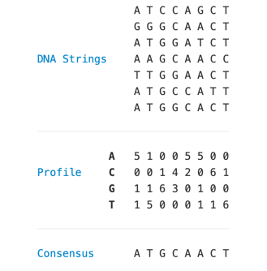

## Problem
A matrix is a rectangular table of values divided into rows and columns. An m×n matrix has m rows and n columns. Given a matrix A, we write Ai,j to indicate the value found at the intersection of row i and column j.

Say that we have a collection of DNA strings, all having the same length n. Their profile matrix is a 4×n matrix P in which P1,j represents the number of times that 'A' occurs in the jth position of one of the strings, P2,j represents the number of times that C occurs in the jth position, and so on (see below).

A consensus string c is a string of length n formed from our collection by taking the most common symbol at each position; the jth symbol of c therefore corresponds to the symbol having the maximum value in the j-th column of the profile matrix. Of course, there may be more than one most common symbol, leading to multiple possible consensus strings.

+ Given: A collection of at most 10 DNA strings of equal length (at most 1 kbp) in FASTA format.

+ Return: A consensus string and profile matrix for the collection. (If several possible consensus strings exist, then you may return any one of them.)

## Sample Dataset
```
>Rosalind_1
ATCCAGCT
>Rosalind_2
GGGCAACT
>Rosalind_3
ATGGATCT
>Rosalind_4
AAGCAACC
>Rosalind_5
TTGGAACT
>Rosalind_6
ATGCCATT
>Rosalind_7
ATGGCACT
```
## Sample Output
```
ATGCAACT
A: 5 1 0 0 5 5 0 0
C: 0 0 1 4 2 0 6 1
G: 1 1 6 3 0 1 0 0
T: 1 5 0 0 0 1 1 6
```
